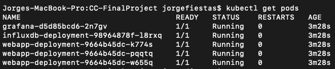

# Stocks Manager

- jorge.fiestas@utec.edu.pe
- ferndando.delosheros@utec.edu.pe

## Introduction

Time series analysis is an extremely powerful tool that allows the prediction of future values of the series and possible trends just based on these trends alone. One of the most common and profitable applications of such analysis is to run predictions of the stock market in order to know beforehand when the good moments to buy and sell should happen. In the past, these analysis were done through the study of theory and finances, however, with the arrival of new technologies and the democratization of information, a new paradigm for time series analysis has emerges: Artificial Intelligence trained on Big Data.

However one huge disadvantage of time series analysis is the computational complexity these computations have. Even for simple models, the computational power and time that it would take to compute and accurate prediction is not small at all, specially if are thinking about a PC scale. What is even worse is that many times keeping track of a single stock is not enough to have sufficient information, many time models have to be trained on multiple distinct series and metrics.

## Solution Proposal

Considering the problems described above, we propose a *Stock Managment* platform that will allow users to keep track of their stocks of interest and compute time series analysis and predictions on these. The three main capabilities of our platform should be:

1. **Scrapping:** Recent stocks data can be obtained in order to have up-to-date information. User can manage which stocks he would like to track.
2. **Analysis:** Using the data fetched by the scrapper, the user should be able to run analysis of these time series.
3. **Visualization:** Users can have access to UI services that make the data obtained digestible.

In a way this will be similar to *FaaS* platforms, with the main difference being that the functions users can call are limited by the API. This way, even users with beginner level understanding of topics of programming and stocks can have a friendly platform to query from. As well, in-memory processing will be used in order to realize the complex calculations.

## Deployment

In order to make the deployment process simple, we have used a `Makefile` to invoke all deployment files. The deployment happens in to steps: first the docker images are built and then the kubernetes deployments and services are deployed.

```bash
make app
make all
```

In order to check that all pods were properly deployed we can run the command `kubectl get pods`. This should output all pods and their status:



**Note:** If the application is going to be deployed locally, you might need to change the docker context to build images within the Kubernetes cluster. In order to do this run the command:

```bash
eval $(minikube docker-env)
```

## Accessing the Application

To access the different components of the application, users can use a *SSH tunnel*, that will redirect a port of the cluster to a port in the users `localhost`. The ports of the webapp, InfluxDB and Grafana are 5000, 8086 and 3000 respectively. In order to open a SSH tunnel we can use the following command:

```bash
kubectl port-forward svc/<service-name> <cluster-port>:<local-port>
```

For example, if I want to hook the InfluxDB service to my local port 8086, then I would run the following command:

```bash
kubectl port-forward svc/influxdb-service 8086:8086
```

It is important to note that for the port to remain open, we must keep the terminal tab with the forwarding open. We should see something like this in terminal:


If we now access `http://localhost:8086` we should be directed to the `InfluxDB` user interface.

## Web Application API

Once we have open a tunnel to our web application, we can send requests through the local host. This API currently consists of two queries: `fetch` and `prediction`. 

1. `fetch/<stock>/<bucket>`: Through this request we tell the API to fetch data of a stock and dump it in a bucket. For this to work the bucket must already exist in the database. Example: `fetch/TSLA/MyBucket`. 
2. `prediction/<stock>/<bucket-from>/<bucket-to>`: This request will fetch data from the in-bucket and run predictions using `Prophet`. This predictions the will be dumped to the out-bucket. Example: `prediction/TSLA/MyBucket/PredBucket`

We will be able to see this data in the InfluxDB interface.

## Demo

https://github.com/Jorgefiestas/CC-FinalProject/blob/main/docs/fetch.mp4

## Architecture


**Alpha Vantage:**
Alpha Vantage is an API that allows services to access stocks data through HTTP requests. Alpha Vantage usually has a very elaborate API that allows to realize all kinds of queries, however, for the scope of this proyect we chose two query 1 year of data for each stock in intervals of 5 minutes. Stocks can be accessed through their stock market code **eg** AAPL (Apple), TSLA (Tesla), etc. This will be the only component of the solution that is not hosted on the kubernetes cluster.

**InfluxDB:** 
InfluxDB is a database manager specialized in the indexation and storage of time series data. The two main ways two communicate with InfluxDB are through its `Python` client `influxdb_client`, or through requests with its own query language: *Flux*. We build InfluxDB in a container with a persistent volume in order to maintain the stored data. This will be one of our Kubernetes services.

**Grafana:**
Grafana is a web platform that allows to easily visualize data through a simple UI that has many custom graph options. This application has support to easily connect to InfluxDB buckets through HTTP. We also built Grafana in a container and ran it as a Kubernetes service.

**WebApp:**
Our web application is a simple API server that allows for simple HTTP request. We used Pythons `Flask` in order to implement it. This service also has access to InfluxDB and Alpha Vantage through the Python client and HTTP respectively. As no data is stored in this service, we decided to lunch multiple replicas of the application in different pods in order to prevent down time and better distribute the number of requests.

**Prophet:** 
Prophet is a Python library with built-in time series analysis functionalities. We will be using this library to run the predictions on the web application.


## Scalability

The request heavy parts of our application will be the web application and our InfluxDB service, as they will constantly receive I/O requests. We believe both of this services need some form of scaling in order to deal with higher or lower requests per second. However, as they are different in nature, we believe that each of this should have a different type of scaling.

As the web application works *in memory* and loads the information from *Alpha Vantage* and *InfluxDB*, we believe that the best option for this pods will be horizontal scaling. This is also compatible with the nature of *Flask*, that tends to have sequential processing. To achieve this we can use a Kubernetes horizontal pod auto-scaling service (HPA). To do this we deployed and auto-scaler that will scale up every time the application reaches 70% of CPU usage and will have a maximum of 10 pods.

For InfluxDB scaling horizontally can be a challenge as it has persistent data that would need to be replicated or a more complex query system would need to be built. In order to avoid this we opted for vertical scaling, as InfluxDB already has a parallel processing nature. For this reason we believe that is better to opt for vertical scalability. In order to achieve this we can use a Kubernetes vertical pod auto-scaling service (VPA).

## Conclusions

In conclusion we managed to deploy a functional application for stocks management. Kubernetes helped us to simplify and abstract the cluster-deployment procedure by covering some of the more complex tasks as load balancing and scalability with a layer of abstraction. Even with the limitations of the model and architecture we managed to get overall accurate predictions and cover most of the functionalities we intended initially.

Some improvements can still be done in order to make the overall functionality of the application better. The web application can be improved by handling the processing and scrapping asynchronously, instead of during the http request. Having the ports open for the shortest amount of possible is always good as it increases the amount of available port at any given point and it is more secure. This should go hand in hand with a user interface implementation. As well, another improvement that would make the deployment easier would be to find a more efficient way of editing images, that do not involve building them from the ground up again. 

In the future this project can be extended by including new functionalities for the time series analysis, improving the prediction models and finding a way to have a distributed database. 
