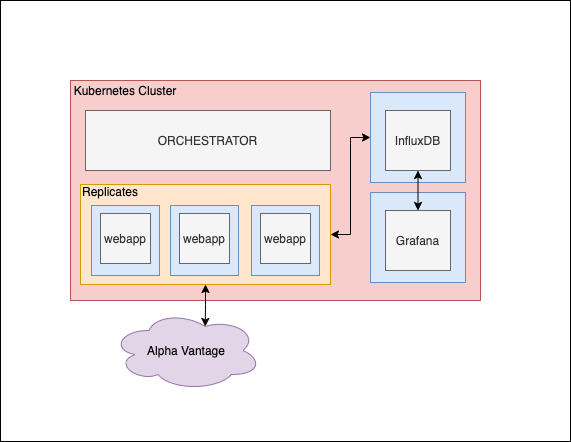

# Stocks

- jorge.fiestas@utec.edu.pe
- ferndando.delosheros@utec.edu.pe

## Introduction

In this proyect we will attempt to deploy a *cloud service* that allows user to keep track of some stocks of interest, run analysis on these stocks and save all this information in a DataBase.

## Architecture

**InfluxDB:** 
A database manager specialized in the storage of time series. 

**Grafana:**
Allows tu visualize data graphically.
